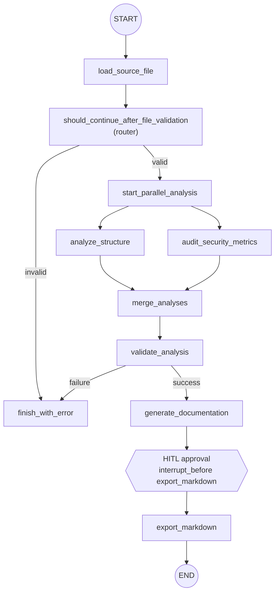

## Fluxo do Agente

O grafo do agente usa validacao condicional do arquivo e, quando a entrada e valida,
dispara duas analises independentes em paralelo. Os resultados convergem em
`merge_analyses`, que valida e consolida os dados antes da geracao da documentacao.
O estado e persistido em `checkpoints.db` com `SqliteSaver`, e o fluxo pausa antes de
`export_markdown` para aprovacao humana.

Principais pontos:

- `CodeAnalysisResult` e `DocumentationOutput` sao schemas Pydantic `BaseModel`.
- `analyze_structure` extrai `class_name`, `methods` e `dependencies`.
- `audit_security_metrics` calcula metricas leves e riscos potenciais.
- `merge_analyses` faz o fan-in e grava o resultado consolidado em `extracted_info`.
- `SqliteSaver` persiste checkpoints em `checkpoints.db` para retomar execucoes pelo `thread_id`.
- `interrupt_before=["export_markdown"]` pausa o fluxo antes da escrita em disco para aprovacao humana.
- As tools `read_text_file` e `write_text_file` sao expostas com `@tool` e schemas Pydantic.
- Em caso de falha nas validacoes, `finish_with_error` marca `success=False` e preserva `errors`.

Arquivos relevantes:

- `app/graph.py` - configuracao do grafo, fan-out e fan-in
- `app/schemas.py` - schemas Pydantic de analise e saida
- `app/nodes.py` - nos do workflow
- `app/tools.py` - tools validadas com schemas Pydantic
- `app/routers.py` - roteadores de decisao
- `app/state.py` - definicao do `AgentState`
