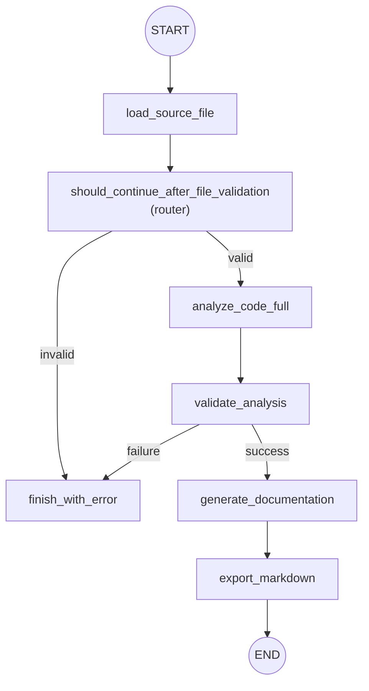

## Fluxo do Agente (Condicional)

O grafo do agente agora utiliza arestas condicionais (conditional edges) e roteadores
separados para decisões. A versão atual implementa validações leves e rota para um
último nó de erro quando necessário, mantendo o fluxo simples e extensível.

Principais pontos:

- A validação de arquivo é implementada como um *router* (`should_continue_after_file_validation`)
  que também garante a leitura e população de `source_code` quando necessário — isso evita
  atualizações concorrentes no estado.
- A análise usada no fluxo (`analyze_code_full`) realiza uma extração simples de
  `class_name` e `methods` para validação mínima.
- Em caso de falha nas validações, o nó `finish_with_error` marca `success=False`
  e preserva `errors` no estado para revisão do usuário.

Arquivos relevantes:

- `app/graph.py` — configuração do grafo e arestas condicionais
- `app/routers.py` — roteadores de decisão
- `app/nodes.py` — nós do workflow (`analyze_code_full`, `validate_analysis`, `finish_with_error`, ...)
- `app/state.py` — definição do `AgentState` (contém `success`, `errors`, `warnings`)

Esse fluxo foi desenhado para demonstrar recursos do LangGraph sem aumentar
complexidade desnecessária; é simples de estender (memória, ferramentas,
intervenção humana) quando for necessário.
