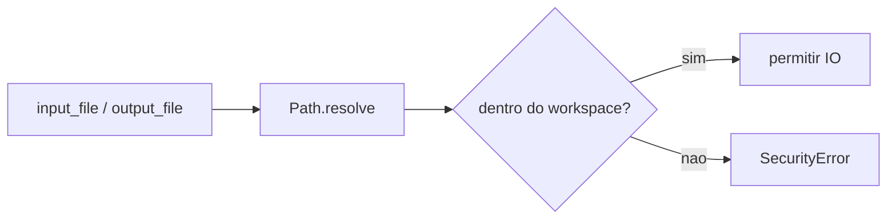
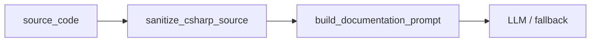
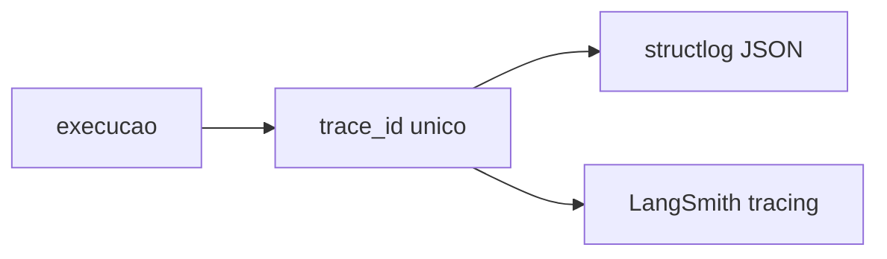
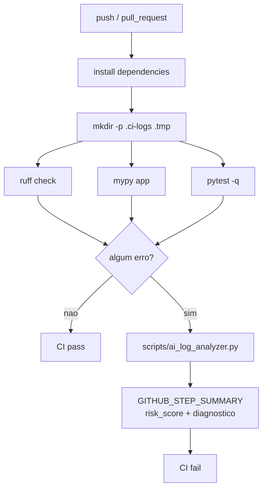

## Fluxo Atual do Agente

O agente pode ser acionado por CLI ou por HTTP via FastAPI. Ambos os caminhos montam um `AgentState`, geram um `trace_id`, validam os caminhos dentro do workspace e executam o grafo LangGraph.

```mermaid
flowchart TD
    cli["CLI\npython -m app.main"] --> state["AgentState inicial"]
    api["FastAPI\nPOST /webhooks/documentation"] --> state
    state --> trace["trace_id + workspace_root"]
    trace --> graph["build_graph"]
    graph --> load["load_source_file"]

    load --> sanitize["sanitize_csharp_source"]
    load --> file_router{"should_continue_after_file_validation"}
    file_router -- invalid --> finish["finish_with_error"]
    file_router -- valid --> fanout["start_parallel_analysis"]

    fanout --> structure["analyze_structure"]
    fanout --> security["audit_security_metrics"]
    structure --> merge["merge_analyses"]
    security --> merge

    merge --> validate["validate_analysis"]
    validate -- failure --> finish
    validate -- success --> qa_gate{"include_qa_review?"}
    qa_gate -- yes --> qa["review_code_quality"]
    qa_gate -- no --> generate["generate_documentation"]
    qa --> generate

    generate --> retry["LLM call with tenacity retry\nor local fallback"]
    retry --> hitl{{"interrupt_before export_markdown"}}
    hitl --> export["export_markdown"]
    export --> done((END))

    api -. auto resume .-> export
    export -. Discord embed .-> discord["DISCORD_WEBHOOK_URL"]
```

## Nós do Grafo

- `load_source_file`: le o arquivo C# depois de validar o path e grava `source_code` e `sanitized_source_code`.
- `start_parallel_analysis`: no de fan-out para execucao paralela.
- `analyze_structure`: extrai classe, metodos publicos e dependencias `using`.
- `audit_security_metrics`: calcula contagem de linhas e padroes de risco.
- `merge_analyses`: consolida `structure_analysis` e `security_metrics` em `extracted_info`.
- `validate_analysis`: exige ao menos classe ou metodos antes de gerar docs.
- `review_code_quality`: no opcional de QA estatica e revisao por LLM.
- `generate_documentation`: monta prompt com codigo sanitizado, chama LLM com retry e usa fallback local quando necessario.
- `export_markdown`: escreve a documentacao no caminho validado.
- `finish_with_error`: finaliza execucoes invalidas com `success=False`.

Todos os nos sao envelopados por `_logged_node`, emitindo logs JSON com `trace_id`, `node_name`, `timestamp`, `event` e `level`.

## HITL e Memoria

O grafo e compilado com:

```python
interrupt_before=["export_markdown"]
```

Isso cria uma pausa antes da escrita final em disco. A CLI pode retomar a execucao usando o mesmo `thread_id`:

```bash
python -m app.main examples/sample_service.cs --thread-id demo-session
python -m app.main examples/sample_service.cs --thread-id demo-session --approve-export
```

A persistencia usa `SqliteSaver`, criando memoria de execucao baseada em checkpoints. A API webhook usa um checkpoint em `.tmp/<thread_id>.db` e resume automaticamente quando detecta a pausa antes de `export_markdown`.

## Segurança

Antes de qualquer leitura ou escrita:



Antes do LLM:



A sanitizacao neutraliza delimitadores e instrucoes como `system:`, `developer:`, `user:` e `ignore previous instructions`.

## Observabilidade



Variaveis relevantes:

- `LANGCHAIN_TRACING_V2=true`
- `LANGSMITH_TRACING=true`
- `LANGSMITH_API_KEY`

No GitHub Actions, o tracing e desligado durante os quality gates para evitar falhas por credenciais ausentes ou invalidas no ambiente de CI.

## Webhook e Discord

Endpoint:

```text
POST /webhooks/documentation
```

Payload:

```json
{
  "input_file": "examples/sample_service.cs",
  "output_file": "output/webhook-doc.md",
  "thread_id": "optional-thread-id",
  "include_qa_review": false,
  "notify_discord": true,
  "discord_webhook_url": "optional-request-scoped-webhook"
}
```

Resposta:

```json
{
  "trace_id": "...",
  "thread_id": "...",
  "status": "success",
  "output_file": "output/webhook-doc.md",
  "documentation_summary": "...",
  "metrics": {
    "class_name": "SampleService",
    "method_count": 2,
    "dependency_count": 1,
    "line_count": 17,
    "risk_count": 0
  },
  "notification_sent": true,
  "errors": [],
  "warnings": []
}
```

A notificacao Discord usa embed visual com status, `trace_id`, arquivo de saida, resumo da documentacao e metricas.

## DevOps

O CI executa os quality gates e captura logs:



O analisador de logs usa LLM quando disponivel. Sem credenciais, ele calcula risco e gera um resumo heuristico com base nos logs de `ruff`, `mypy` e `pytest`.

## Arquivos Relevantes

- `app/api.py`: FastAPI, webhook trigger e notificacao Discord.
- `app/graph.py`: montagem do grafo, QA opcional, checkpoints e HITL.
- `app/nodes.py`: nos principais de leitura, analise, geracao e exportacao.
- `app/qa.py`: revisao estatica e sugestoes de refatoracao.
- `app/security.py`: sanitizacao contra prompt injection e validacao de paths.
- `app/logging_config.py`: logs JSON e LangSmith.
- `app/tools.py`: tools LangChain com schemas Pydantic.
- `scripts/ai_log_analyzer.py`: diagnostico de falhas de CI.
- `.github/workflows/ci.yml`: pipeline de qualidade.
